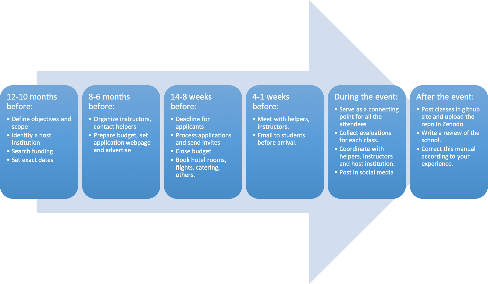

#**Director Manual for Organizing Schools**

The CODATA Research Data Science Schools are a fantastic opportunity to
provide foundational data skills to Early Career Researchers in your
region. We have run six Schools to date (three in Trieste, Italy, one in
Kigali, Rwanda, and two in Sao Paulo, Brazil) in collaboration with the
International Centre for Theoretical Physics (ICTP) and its sister
organisations SAIFR and EAFIR.

As a Director of the school, you will have to go through the following
steps:

##**12 to 10 months before the event:**

##**Scope and remit of the School**

The Schools should be for a minimum of 20 students. An upper limit is
not set as this will depend on the venue facilities and financial
support available, but experience shows that 30-40 students is optimum.
Accepted applicants should be diverse in terms of gender, nationality
(i.e. from the region), ethnicity and discipline. The majority of
attendees for the school should be Early Career Researchers with some
introduction to Statistics in their undergraduate career (e.g. they
should understand concepts such as correlation).

You should also consider your vision for the School - do you want this
to support a regional audience (e.g. an East African School drawing
participants from a small number of neighbouring countries and a greater
percentage from the direct vicinity / city in which the School is
hosted) or an international school with participants from a wide range
of countries and continents?

##**Identify a host institution**

Hosting requires a significant investment of time and finances. The host
will be expected to provide a venue for the School, administrative
effort to support the application process, coordination and on-site
liaison, and financial support for participants. A recent regional
school in Brazil for 32 students cost approximately €13,000 to cover
student travel, accommodation and catering costs during the School. This
is in addition to any venue costs.

###[Venue and catering facilities]

Hosts are required to provide a venue for the School. Catering for
coffee breaks should be provided on site and either onsite or closeby
lunch options are required.

Accommodation should also be provided for students and speakers. Ideally
this would be onsite or reasonably accessible via public transport
links. Students typically share twin rooms while speakers have a private
single room.

Hotel accommodation and venue facilities should have reliable (wifi)
internet connections.

###[Computer Laboratory]

There needs to be lab space with machines running the Linux OS, as well
as a seminar room. Some software will need to be installed before the
school (for example R and RStudio) and the students should have their
own accounts for the duration of the school so that they can store their
data. The machines themselves do not have to have a particularly fast
CPU or large memory but a reasonable amount of connectivity is required
(download speeds of at least 10 Mbps for the entire class). Support will
need to be on hand to deal with issues during the lab or to deal with
any problems with projectors etc.

###[Administrative support]

The local host should assist in the entire administrative process to
plan, coordinate and deliver the Schools. This will require regular
calls with the Task Group and specific inputs to support the application
process and arrange student visas (if required) and travel logistics.

An online system should be offered to collect, process and evaluate
applications. These comprise a short webform, CV and support letters
attachments. The host should allocate effort to contribute to the
evaluation process and ensuring a balanced mix of participants. It is
not necessary for the online system to be hosted locally.

Depending on the mix of participants, visas may need to be arranged. The
host should provide the necessary administrative support for this, and
assist students with travel logistics and bookings. The CODATA Task
Group will liaise with speakers and seek funding to cover their costs.

##**Financial support**

Investment is needed to support student travel, accommodation and
catering. The exact level of this will vary depending on the home
location of participants. Assuming the School is held in a large urban
area, one could estimate that c.30-50% of the participants come from the
local area and may not need overnight accommodation. Others should be
from the region so travel bursaries, daily subsistence stipends and
accomodation for the fortnight should not exceed €800 per student.

Common funding sources: Springer Nature, RDA Europe, RDA US, ICTP
(Trieste, SAIFR or Kigali), Wellcome Trust. While the Task Group has
secured a range of sponsorship in the past, particularly to support
speaker costs, the local organisers should not rely on the TG to provide
financial support

##**Exact dates**

When defining the exact dates, the co-chair should take into account
that each location has its own particularities. Summer periods should be
considered as the best time to organize the School, as most of the
students and or instructors will have free time to attend. Also, it is
recommended to avoid organizing the event in the same period as a major
holiday in the host country (Brazilian Carnival, Christmas for Catholic
countries, Ramadan for Muslim countries).

##**8 to 6 months before the event:**

##**Organize instructors, contact helpers**

As the Schools aim to develop regional expertise, local instructors
should teaching a minimum of 30% of the material. Other chairs can
provide recommendations from Software/Data carpentry networks, CODATA
and Research Data Alliance communities if required. Ideally, helpers
should be alumni from the Schools that expressed interest in
collaborating with the programme in the future. Our experience show that
the best way to train future trainers and future members of the working
group is inviting them to be helpers in one school.

This [[list of
contacts]{.underline}](https://docs.google.com/spreadsheets/d/15YyeY-dl9t52Qrk9G0FmnsrUzCXDnnEDDJ1gJ9IipiM/edit#gid=731581240)
should be useful to start the search.

##**Prepare budget, set application web page and advertise**

An example of a typical budget is in here. The prices for the hotel,
daily stipend and catering service should be provided by the host
institution. The flight ticket prices can be estimated using the online
service
[[https://www.hipmunk.com/flights]{.underline}](https://www.hipmunk.com/flights)
or any other site that allows to compare best prices.

The application web page and the advertisement should be created by the
host institution, nevertheless, the co-chair responsibility is to check
that it includes all the necessary information. Here are some
advertisement examples from previous events:

-   http://indico.ictp.it/event/8329/

-   http://www.ictp-saifr.org/international-school-on-data-science/

-   http://www.ictp-saifr.org/2018-codata-rda-school-of-research-data-science/

Please take into account that it is important to reach diverse
populations. Some ICTP lists can be really heavy loaded in male
physicist members, so please distribute in different channels that can
bring a more diverse background to the school.

The host will set up a system to record answers to a questionnaire
(source). The deadline for applicants should be 8 weeks before the
event.

##**14-8 weeks before the event:**

##**Process applications and send invites**

The students will be scored according to [[this
guideline]{.underline}](https://docs.google.com/document/d/10MHYm0bm1L2nEMcNaA8kmXKuh24sg1OKhqRF4VrStgQ/edit)
by at least 2 TG members. The final decisions will be taken according to
the funding restrictions, but also taking into account: best score,
gender balance and region/countries of origin balance. Make sure to
reach something close to a gender balance, if possible.

The invitation to selected students should be sent by the host
institution, as well as the hotel room and flight booking for students.

##**Close budget**

The budget should be clear about sponsors for each of the instructors
and helpers. The host institution will manage the local funds (funds
from sponsors transferred directly to them) and the co-chair will help
managing the funds provided via CODATA or RDA.

The catering service and the event dinner should be coordinated by the
host institution, but in some cases the budget can come from non local
sponsors. Eight weeks before the event the co-chair should be clear
about the travel funds for all the confirmed sponsored attendees.

##**4-1 weeks before the event:**

##**Meet with helpers, instructors**

At least two calls should be scheduled with all the instructors, helpers
and directors of the School to do introductions and run through the
agenda. These calls should cover topics like our expectations from
instructors and helpers, as well as logistic details that have not been
clarified before.

##**Email to students before arrival**

This is an
[[example]{.underline}](https://docs.google.com/document/d/1bqHqL7lk6tOjnua3A3AkUl1FpWwbb2jXR4BVv9TT23Q/edit).
Try to organize an informal meetup the Sunday before the workshop start.
It is important that those students that made it there early can meet
each other.

##**During the event:**

##**Coordinate with helpers, instructors and host institution.**

Here is a list of suggested responsibilities for the helpers:

-   Try to get all the students to have their Biosketch uploaded before
    > the start of our first class on Monday.

-   Be part of the group discussions for the Open Science classes.

-   Insist on the green and red sticky note system for all classes.

-   There are two feedback types that we need the students to fill out:
    > one at the end of each workshop and the green/red sticky note
    > system at the end of each class. The first one will be processed
    > after the two weeks, but the second one should be processed each
    > day. We can create [[a similar
    > form]{.underline}](https://docs.google.com/forms/d/e/1FAIpQLSeYl6o9U74up43M_fhPn-So9bE2xoWnoRTBKL-aUg-BEJD8Og/viewform)
    > to process the responses.

-   Process daily feedback - word cloud. Maybe here I need just one
    > volunteer, or you can rotate the labor, here is a guide on how to
    > do it: https://github.com/joselatrans/wordCloudsRDASP18

-   Help to keep the Etherpad updated.

-   Encourage networking during the breaks. Ask people about their
    > research, and if you can, introduce other people with similar
    > topics of interest.

-   Upload material from instructors in a repo like this one:
    > https://github.com/CODATA-RDA-DataScienceSchools/Materials/blob/master/docs/index.md

-   Post pictures on social media using \#data\<Location\>\<Year\>

-   Lead the way for lunch places

-   Lead the way from the hotel to school venue.

##**Serve as a connecting point for all the attendees**

##**Collect evaluations for each class.**

##**Post in social media**

The event will be tweeted extensively during the school with the hashtag
\#data\<Location\>\<Year\>. The organisers will provide a number of
group photos and provide the files so that they can also be tweeted.
Attendees of the school will be requested to join the Alumni Facebook
page and will also be contacted in the future for anonymised
longitudinal studies.

##**After the event:**

##**Post classes in github site and upload the repo in Zenodo.**

Upload material from instructors in a repo like this one:
https://github.com/CODATA-RDA-DataScienceSchools/Materials/blob/master/docs/index.md

##**Write a review of the school.**

##**Thank you notes and blog posts**

Dear (helper\'s name),

On behalf of the CODATA-RDA initiative, we want to thank you for your
contribution to our School. Your help and work during these two weeks
were key components to make our school work, we appreciate your
commitment and your professionalism.

We hope to have the chance of collaborating with you in the future. If
you would like to write a blog post with your experience as a student
and then as a helper, we invite you to share it with us. We would be
very happy to suggest Springer Nature publish it.

Best regards,

\#\#\#\#\#\#\#\#\#\#\#\#\#\#\#\#\#\#\#\#\#\#

Dear (instructor\'s name),

On behalf of the CODATA-RDA initiative, we want to thank you for your
contribution to our School. Your lectures were very well received by the
students as you can see on your evaluation report attached.

The report has two parts: answers to our feedback questionnaire for your
section and also two different word clouds produced using the green and
red sticky notes. The green notes were positive and the red notes were
negative.

We hope to have the chance of collaborating with you in the future.

Best regards,

#**Correct this manual according to your experience.**
